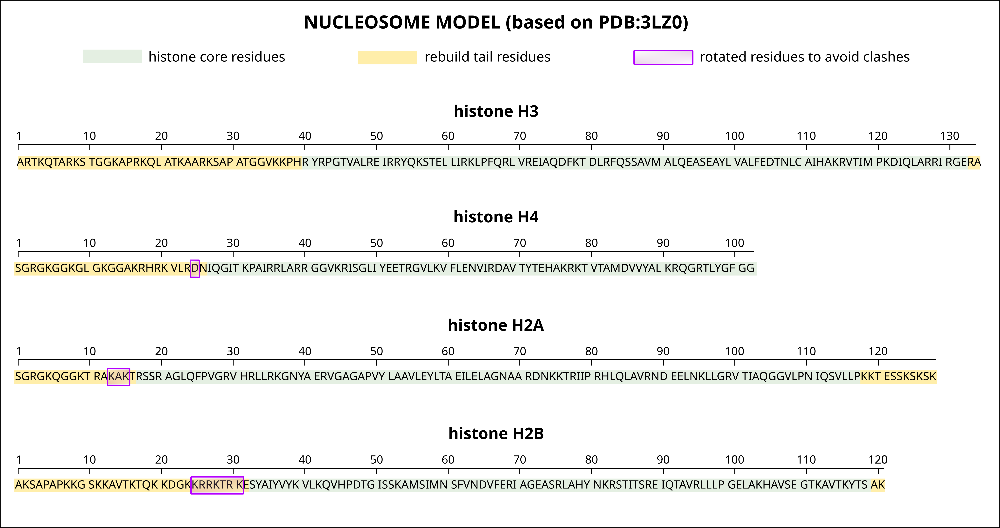
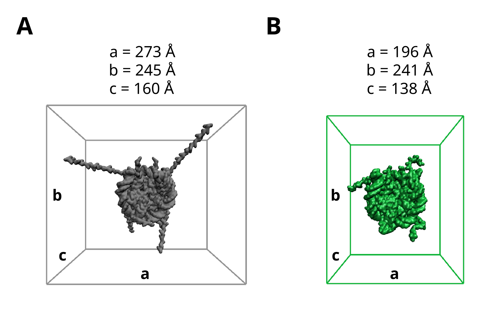

## MD setup:

### 1. Construction of nucleosome model
*Note! The preparation of initial structure has been finished yet*

The initial NCP coordinates were constructed based on the crystallographic structure PDB:3LZ0. This template of NCP does
not contain all residues coordinates at the end of histone tails. We used the next multi-step protocol to model the
missing residues (see Fig. 1) :

1) clip histone tails from original structure 3LZ0 at sites H3K39-R134, H4N25, H2A T16-K118, and H2BE32-A121
2) generate free histone tails with `tleap` within Amber20 in force field ff14SB
3) rotate free histone tails to obtain linearly extending tail conformations
   (dihedral angles for each residue Φ=−60° and Ψ=150°).
4) glue free histone tails onto the body of the corresponding histone by superimposing N, Cα and C' atoms in the
   overlapping residues.
5) Remove steric clashes in glued histone tails surrounding the truncated sites (nucleosome DNA or histone core). For
   this purpose, the next Φ and Ψ angles in rebuild tails were set as in crystallographic structure with partial histone
   tail coordinates (PDB:1AOI)

  
  <figcaption> Figure 1. The protocol for preparation the initial coordinates of the NCP with full-length histone tails.
                         The histone core residues are taken from original structure 3LZO are denoted with green color. 
                         The positions of rebuilded histone tails are denoted with yellow color. 
                         The rotated sites to adjust clashes are denoted with magenta color

### 2. MD simulation
The NCP structure with linearly extended histone tails was protonated to match the experimental ph 7. The Na+ and Cl-
ions have been added to neutralize the system and to match 100 mM NaCl. The system was solvated with TIP4P-D water (12 Å
minimal separation between the NCP atoms and the boundary of rectangular box). After 100-ns initial run, all tails
adopted more compact conformations; at this point, the simulation was stopped and the system was resolvated (rectangular
box with dimensions 197 Å, 241 Å and 138 Å). These box dimensions were estimated from the previously recorded MD
trajectories of the NCP totalling 41 μs length (Peng J, et al. (2021)). For this purpose, the MD trajectories were scanned for the most extended configurations in the
three dimensions. The found values of dimension were used to construct simulation box and solvate system with closeness
0 (see Fig. 2). The resolvated configuration was used to start the production run. During the simulations, the equations
of motion were integrated using the leapfrog algorithm with a time step of 2 fs. Bonds involving hydrogen atoms were
constrained using SHAKE algorithm. The non-bonded interactions were calculated with cutoff of 10.5 Å, as recommended for
disordered proteins. Long-range interactions were treated using a particle-mesh Ewald summation scheme with default
parameters for grid spacing and spline interpolation. Constant pressure was maintained using Berendsen barostat with
relaxation time 2 ps. Bussi thermostat was used to stabilize temperature at 25°C. The same protocol was used for (Amber
ff14SB / OPC) simulation, including the size of the simulation cell that was identical to (Amber ff14SB / TIP4P-D)
trajectory.

  
  <figcaption> Figure 2. The dimensions of simulation box before and after equilibration of histone tails. 
                         The panel A illustrates the bigger initial box for simulation of the nucleosome with the fully 
                         extended histone tails. The bigger box was constructed with minimal separation between the NCP atoms 
                         and the boundary 12 Å . The panel B illustrates the smaller box for simulation of the nucleosome 
                         with collapsed histone tails after equilibration run over 100 ns. The dimensions of the smaller box 
                         were estimated from the previously published long MD trajectories of the nucleosome. 

